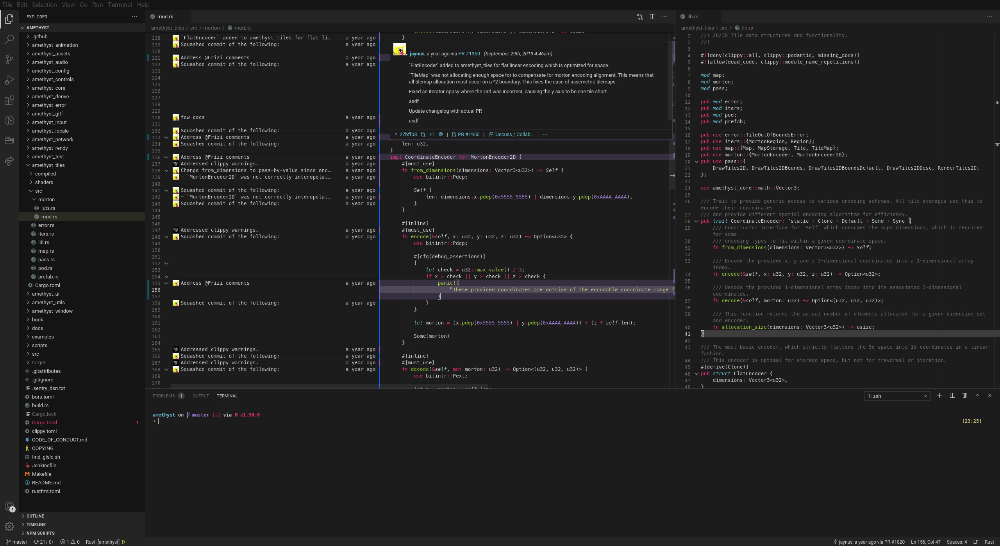
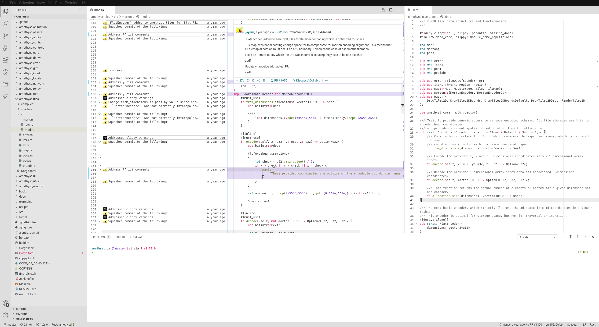

# Rubecula

The "Rubecula" theme is a hyperminimal theme based on [AmCoder Bright](https://github.com/auiWorks/amCoder) with some changes but faithful to the colour scheme. Additionally there is the "Rubecula Dawn" theme which is its light version for during the day.

## Contributing

### Issues

For reporting bugs, see [`.github/ISSUE_TEMPLATE.md`](.github/ISSUE_TEMPLATE.md). For other requests, feel free to make an issue.

### Building

`template.js` contains the colors and logic to convert the template to a valid color scheme file with colors. The file requires that `sed` is available on your `PATH`. However this file is only required for testing as the formatted color scheme is not added to the repository.
